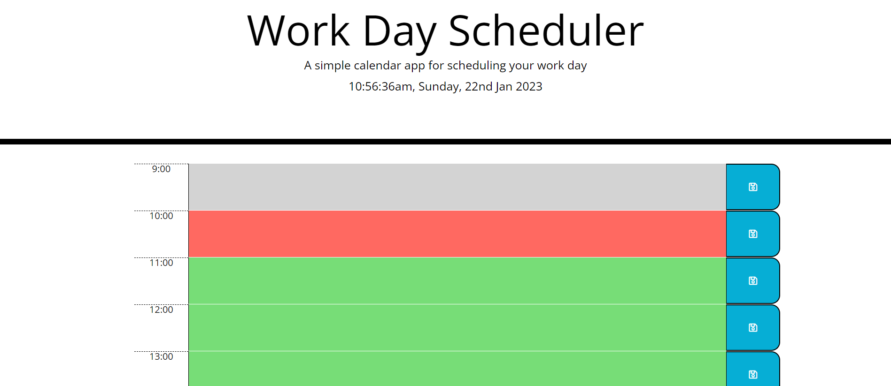

## Table of contents

- [Overview](#overview)
  - [The challenge](#the-challenge)
  - [Screenshot](#screenshot)
  - [Links](#links)
- [Author](#author)

## Overview

### The challenge

* Here's day planner for you to use and enjoy :)
* While creating it I have learned how to use jquery, moment.js and how website can be built with no html input.
* Few things could probably be done better (I'm looking at you colors!), and I will work on it in free time.

### Screenshot

### Links

* You can see deployed day planner here: https://skwiera-magic.github.io/planner-app

## Author
- Skwiera-Magic - [My GitHub](https://github.com/Skwiera-Magic/)